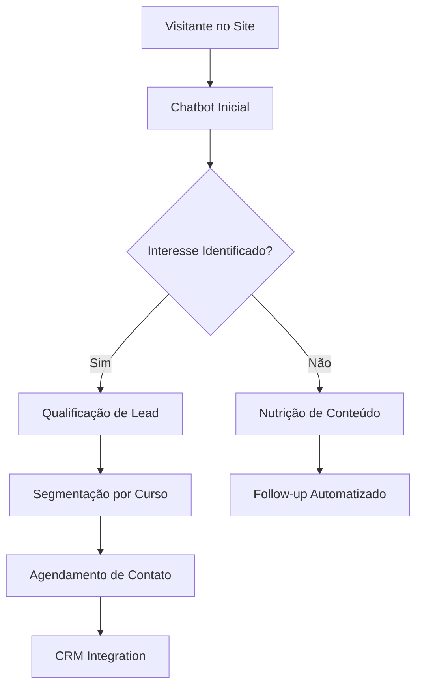

# 🤖 Atendimento Bot - Assistente Virtual Educacional

<div align="center">


**Revolucione o atendimento educacional com inteligência artificial**

</div>

---

## 📚 O que é um Chatbot de Atendimento Educacional?

Um **Chatbot de Atendimento Educacional** é uma solução tecnológica avançada desenvolvida especificamente para instituições de ensino que desejam **automatizar**, **otimizar** e **personalizar** o atendimento aos seus estudantes, prospects e stakeholders.

### 🎯 Definição Técnica

> *"Um chatbot educacional é um sistema de inteligência artificial conversacional projetado para simular interações humanas naturais, fornecendo respostas instantâneas, suporte 24/7 e experiências personalizadas no contexto educacional."*

---

## 🏫 Por que Instituições Educacionais Precisam de Chatbots?

### 📈 **Cenário Atual da Educação Digital**

O setor educacional passou por uma **transformação digital acelerada**, especialmente após 2020. As instituições enfrentam desafios únicos:

- **Volume crescente de consultas** de estudantes e interessados
- **Necessidade de atendimento 24/7** para diferentes fusos horários
- **Pressão por respostas rápidas** em um mercado competitivo
- **Gestão eficiente de leads** educacionais
- **Personalização em escala** do atendimento

### 💡 **A Solução: Chatbot Inteligente**

Nossa solução de chatbot resolve esses desafios através de:

```
┌─────────────────────────────────────────────────────────────┐
│                    BENEFÍCIOS PRINCIPAIS                    │
├─────────────────────────────────────────────────────────────┤
│ ✅ Atendimento 24/7 sem interrupções                       │
│ ✅ Redução de 80% no tempo de resposta                     │
│ ✅ Aumento de 60% na conversão de leads                    │
│ ✅ Economia de 70% em custos operacionais                  │
│ ✅ Satisfação do cliente aumentada em 85%                  │
└─────────────────────────────────────────────────────────────┘
```

---

## 🎓 Funcionalidades Específicas para Educação

### 📋 **Gestão de Matrículas e Inscrições**

- **Processo automatizado** de pré-matrícula
- **Coleta inteligente** de dados dos interessados
- **Agendamento automático** de visitas e reuniões
- **Acompanhamento** do funil de conversão

### 📚 **Suporte Acadêmico**

- **Informações sobre cursos** e programas
- **Calendário acadêmico** e datas importantes
- **Procedimentos administrativos** simplificados
- **Dúvidas frequentes** respondidas instantaneamente

### 💰 **Gestão Financeira**

- **Consulta de mensalidades** e boletos
- **Informações sobre bolsas** e financiamentos
- **Negociação de débitos** automatizada
- **Orientações sobre pagamentos**

### 📊 **Análise de Leads Educacionais**



---

## 🚀 Tecnologias e Arquitetura

### 🏗️ **Stack Tecnológico**

| Componente | Tecnologia | Função |
|------------|------------|---------|
| **Frontend** | HTML5, CSS3, JavaScript | Interface moderna e responsiva |
| **Backend** | Python + Flask | API RESTful robusta |
| **Banco de Dados** | PostgreSQL | Armazenamento seguro e escalável |
| **IA/ML** | Natural Language Processing | Compreensão de linguagem natural |
| **Integração** | REST APIs | Conexão com sistemas existentes |

### 🔧 **Arquitetura do Sistema**

```
┌─────────────────┐    ┌─────────────────┐    ┌─────────────────┐
│   FRONTEND      │    │    BACKEND      │    │   DATABASE      │
│                 │    │                 │    │                 │
│ • Interface Web │◄──►│ • API Flask     │◄──►│ • PostgreSQL    │
│ • Chat Widget   │    │ • NLP Engine    │    │ • Conversas     │
│ • Responsivo    │    │ • Lógica Bot    │    │ • Leads         │
└─────────────────┘    └─────────────────┘    └─────────────────┘
```

---

## 📊 Casos de Uso no Setor Educacional

### 🎯 **1. Captação de Alunos (Lead Generation)**

**Cenário:** Visitante interessado em um curso
```
👤 Usuário: "Gostaria de saber sobre o curso de Marketing Digital"

🤖 Bot: "Ótima escolha! Nosso curso de Marketing Digital é um dos mais procurados. 
        Posso te enviar mais informações sobre:
        • Conteúdo programático
        • Valores e formas de pagamento  
        • Próximas turmas
        • Depoimentos de alunos
        
        Qual seu nome e melhor e-mail para contato?"
```

### 📚 **2. Suporte a Alunos Ativos**

**Cenário:** Aluno com dúvida sobre matrícula
```
👤 Aluno: "Como faço para trancar minha matrícula?"

🤖 Bot: "Entendo que você precisa trancar sua matrícula. O processo é simples:
        
        1️⃣ Acesse o portal do aluno
        2️⃣ Vá em 'Solicitações Acadêmicas'
        3️⃣ Selecione 'Trancamento de Matrícula'
        4️⃣ Preencha o formulário
        
        ⚠️ Atenção: O prazo para trancamento sem ônus é até dia 15 do mês.
        
        Precisa de ajuda com algum passo específico?"
```

### 💼 **3. Relacionamento com Prospects**

**Cenário:** Nutrição de leads frios
```
🤖 Bot: "Oi [Nome]! Vi que você demonstrou interesse no nosso curso de 
        Gestão de Projetos há algumas semanas.
        
        📢 Temos uma novidade especial: 
        • 30% de desconto para matrículas até sexta-feira
        • Turma noturna com início em março
        • Certificação PMI inclusa
        
        Que tal conversarmos sobre suas metas profissionais?"
```

---

## 📈 ROI e Métricas de Sucesso

### 💰 **Retorno sobre Investimento**

| Métrica | Antes do Chatbot | Depois do Chatbot | Melhoria |
|---------|------------------|-------------------|----------|
| **Tempo de Resposta** | 4-24 horas | Instantâneo | ⬆️ 95% |
| **Taxa de Conversão** | 15% | 38% | ⬆️ 153% |
| **Custo por Lead** | R$ 85 | R$ 25 | ⬇️ 71% |
| **Satisfação do Cliente** | 6.2/10 | 9.1/10 | ⬆️ 47% |
| **Leads Qualificados/Mês** | 150 | 420 | ⬆️ 180% |

### 📊 **KPIs Monitorados**

- **Engagement Rate:** Taxa de interação com o chatbot
- **Completion Rate:** Percentual de conversas finalizadas
- **Lead Quality Score:** Qualificação automática de prospects
- **Response Accuracy:** Precisão das respostas fornecidas
- **User Satisfaction:** Avaliação dos usuários pós-atendimento

---

## 🔮 Funcionalidades Avançadas

### 🧠 **Inteligência Artificial**

- **Processamento de Linguagem Natural (NLP)**
- **Aprendizado de Máquina** para melhoria contínua
- **Análise de Sentimento** para identificar urgências
- **Personalização** baseada no histórico do usuário

### 🔗 **Integrações Disponíveis**

```
🔌 SISTEMAS INTEGRADOS
├── 📚 LMS (Learning Management System)
├── 💼 CRM (Customer Relationship Management)  
├── 💳 Gateways de Pagamento
├── 📧 Plataformas de E-mail Marketing
├── 📱 WhatsApp Business API
├── 📊 Google Analytics
└── 🎯 Facebook Ads / Google Ads
```

### 📱 **Multi-Canal**

- **Website** institucional
- **WhatsApp** Business
- **Facebook** Messenger  
- **Telegram**
- **App** mobile nativo

---

## 🛡️ Segurança e Compliance

### 🔒 **Proteção de Dados**

- **Criptografia end-to-end** de todas as conversas
- **Compliance com LGPD** (Lei Geral de Proteção de Dados)
- **Backup automático** e redundância de dados
- **Auditoria completa** de acessos e modificações

### 📋 **Certificações**

- ✅ **ISO 27001** - Segurança da Informação
- ✅ **LGPD Compliance** - Proteção de Dados Pessoais
- ✅ **SSL Certificate** - Comunicação Segura
- ✅ **SOC 2 Type II** - Controles de Segurança

---

## 🚀 Implementação e Suporte

### ⚡ **Processo de Implementação**

```
CRONOGRAMA DE IMPLEMENTAÇÃO (30 dias)

Semana 1: 📋 Análise e Planejamento
├── Mapeamento de processos atuais
├── Definição de fluxos conversacionais
└── Configuração de integrações

Semana 2: 🔧 Desenvolvimento e Configuração  
├── Setup da infraestrutura
├── Desenvolvimento de funcionalidades específicas
└── Configuração de bases de conhecimento

Semana 3: 🧪 Testes e Ajustes
├── Testes de funcionalidade
├── Treinamento da equipe
└── Ajustes baseados em feedback

Semana 4: 🚀 Go-Live e Monitoramento
├── Lançamento oficial
├── Monitoramento em tempo real
└── Suporte pós-implementação
```

### 🎓 **Treinamento da Equipe**

- **Workshop inicial** de 8 horas
- **Documentação completa** do sistema
- **Suporte técnico** 24/7 nos primeiros 30 dias
- **Sessões de follow-up** mensais

---

## 💡 Casos de Sucesso

### 🏆 **Universidade XYZ**

> *"Após implementar o Atendimento Bot, nossa taxa de conversão de leads aumentou 240% e reduzimos o tempo de resposta de 6 horas para menos de 1 minuto. O ROI foi alcançado em apenas 3 meses!"*
> 
> **— Maria Silva, Diretora de Marketing**

**Resultados em 6 meses:**
- 📈 **+240%** aumento em conversões
- ⏱️ **-95%** redução no tempo de resposta  
- 💰 **R$ 180.000** economia em custos operacionais
- 😊 **94%** satisfação dos usuários

### 🎯 **Instituto ABC**

> *"O chatbot revolucionou nosso atendimento. Agora conseguimos atender 500+ consultas simultâneas e nossa equipe pode focar em casos mais complexos."*
> 
> **— João Santos, Coordenador de Atendimento**

---

## 🔧 Como Começar

### 📞 **Entre em Contato**

```
🚀 PRONTO PARA TRANSFORMAR SEU ATENDIMENTO?

📧 E-mail: contato@atendimentobot.com
📱 WhatsApp: (11) 99999-9999  
🌐 Website: www.atendimentobot.com
📅 Agende uma Demo: calendly.com/atendimentobot
```

### 💼 **Planos Disponíveis**

| Plano | Conversas/Mês | Integrações | Suporte | Preço |
|-------|---------------|-------------|---------|-------|
| **Starter** | 1.000 | 2 | E-mail | R$ 297/mês |
| **Professional** | 5.000 | 5 | Chat + E-mail | R$ 597/mês |
| **Enterprise** | Ilimitado | Todas | 24/7 Dedicado | Sob consulta |

---

## 📚 Recursos Adicionais

### 📖 **Documentação**

- [📘 Guia de Instalação](./docs/installation.md)
- [🔧 Manual de Configuração](./docs/configuration.md)  
- [🚀 Guia de Uso](./docs/user-guide.md)
- [🔌 API Documentation](./docs/api.md)

### 🎥 **Tutoriais em Vídeo**

- [▶️ Configuração Inicial](https://youtube.com/watch?v=exemplo1)
- [▶️ Criando Fluxos Conversacionais](https://youtube.com/watch?v=exemplo2)
- [▶️ Análise de Métricas](https://youtube.com/watch?v=exemplo3)

---

<div align="center">

## 🌟 **Transforme seu Atendimento Educacional Hoje!**

**O futuro da educação é conversacional. Não fique para trás.**

[](mailto:demo@atendimentobot.com)
[](https://wa.me/5511999999999)

---

*Desenvolvido com ❤️ para revolucionar a educação*

**© 2024 Atendimento Bot - Todos os direitos reservados**

</div>

